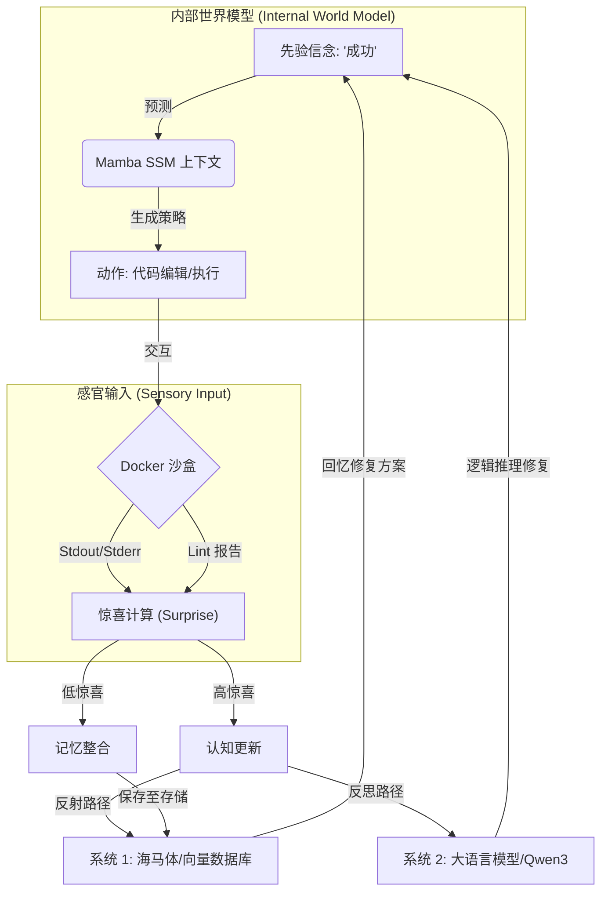

# 🧠 Project Friston: 神经符号主动推理智能体 (V2) ✨

[](https://www.python.org/downloads/)
[](https://pytorch.org/)
[](https://opensource.org/licenses/MIT)

> "通过最小化变分自由能，维护代码库稳态的数字生命。" 🌌

---

## 🧬 项目哲学 🏛️

**Project Friston** 是一个受 **自由能原理 (FEP)** 启发的次世代软件工程智能体。与传统的“无状态”智能体不同，Friston 作为一个具备具身智能的系统，能够持续预测、行动，并从“惊喜”（执行错误）中学习。

它的目标不仅是“编写代码”，而是使其环境（代码库）保持在 **低熵状态**——稳定、无误且逻辑自洽。

---

## 🏗️ 架构可视化 👁️

### 🔄 主动推理循环 (The Active Inference Cycle)
智能体运行在一个持续的预测与感官反馈循环中。



---

## 🧠 模块深度解析 🧪

### 👁️ 感知：超维指纹识别 (Hyperdimensional Fingerprinting)
Friston 不仅仅是“看到”文本，它还能感知代码结构。
* **HDC 编码器**：利用 **超维计算 (HDC)** 将 AST（抽象语法树）节点映射为 10,000 维的双极向量。
* **结构不变性**：通过捆绑 (Bundling) 和置换 (Permutation) 操作，即使变量重命名或格式变化，Friston 也能识别逻辑相似性。
* **LSP 集成**：集成 **Ruff** 和 **Mypy** 作为“前庭感觉”，在代码运行前探测静态不稳定性。

### 💾 记忆：双路径海马体
* **系统 1 (快速路径)**：高性能向量数据库 (**ChromaDB**)，存储 `(错误特征 -> 成功修复)` 对。实现亚毫秒级的“反射式”修复，无需昂贵的 LLM 调用。
* **系统 2 (慢速路径)**：当惊喜过高且记忆检索失败时，激活 **大语言模型 (Qwen3)** 进行深度推理和处理新问题。

### 🐍 上下文：Mamba SSM
* 不同于二次方复杂度的注意力机制，Friston 使用 **Mamba (状态空间模型)** 维护项目演进的线性复杂度“内部状态”，使其能够高效处理超长上下文。

---

## 🚀 快速上手 🛠️

### 📋 预备条件
* **环境**：Linux 或 WSL2 (强烈推荐)。
* **Docker**：用于隔离的代码执行环境。
* **Ollama**：用于运行本地 LLM (Qwen3)。
* **Python**：3.10+

### 📥 安装步骤
```bash
# 1. 克隆并进入目录
git clone https://github.com/lkcfqy/friston.git
cd friston

# 2. 环境配置
# 推荐使用 conda 管理 torch/mamba 依赖
conda create -n friston python=3.10 -y
conda activate friston

# 3. 安装核心依赖
pip install -r requirements.txt

# 4. 准备沙盒镜像
docker pull python:3.10-slim
```

### 🎮 运行 Demo
```bash
# 运行完整的进化循环 (记忆 + LSP + LLM)
python -m experiments.demo_v2_evolution
```

---

## 🗺️ 项目结构

* `src/core/` 🧠：**智能体引擎** - 实现 FEP 循环与 LLM 通讯。
* `src/perception/` 👁️：**感知层** - AST 解析、HDC 编码及 Lint 检查。
* `src/memory/` 💾：**存储层** - 向量数据库、Mamba SSM 及 MHN。
* `src/action/` 🏃：**动作层** - 用于安全执行代码的 Docker 沙盒。
* `experiments/` 🧪：**测试场景** - 用于测试智能体成长能力的预定义任务。

---

> [!TIP]
> **GPU 加速**：如果你拥有支持 CUDA 的 GPU，Friston 将自动利用它加速 HDC 向量运算和 Mamba 推理。

---

*为低熵软件工程的未来而构建。* 🌌
